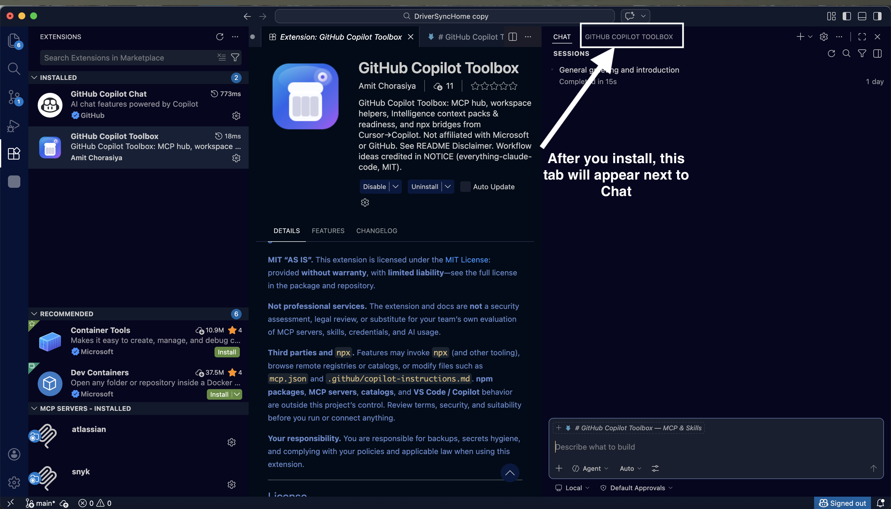
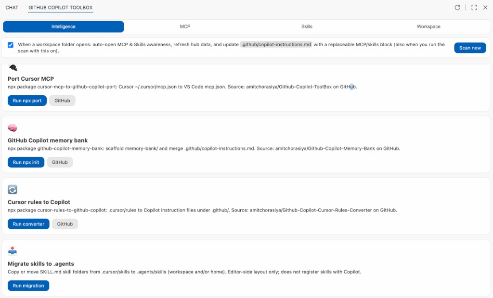
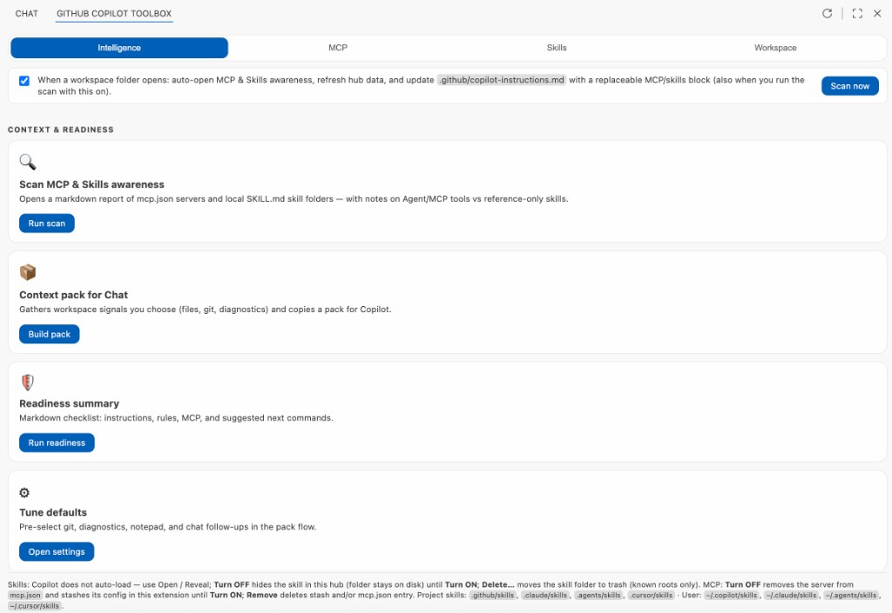
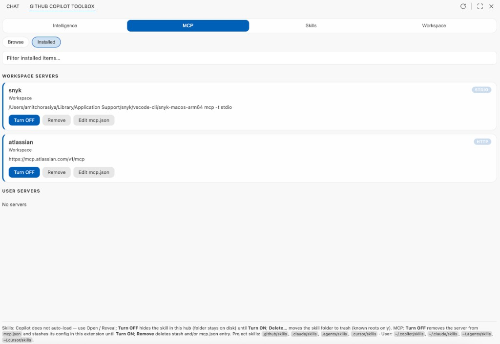
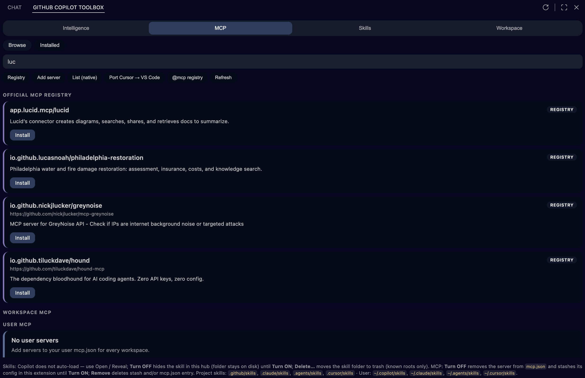
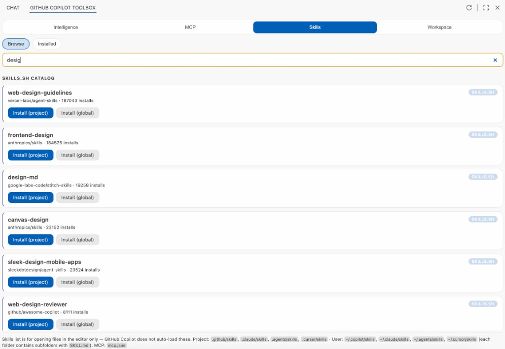
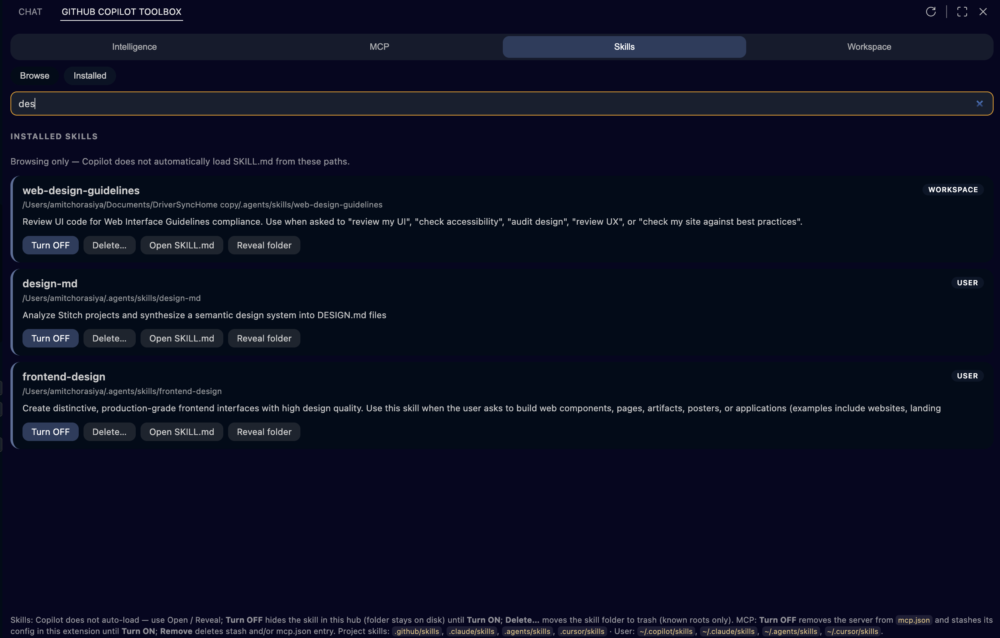
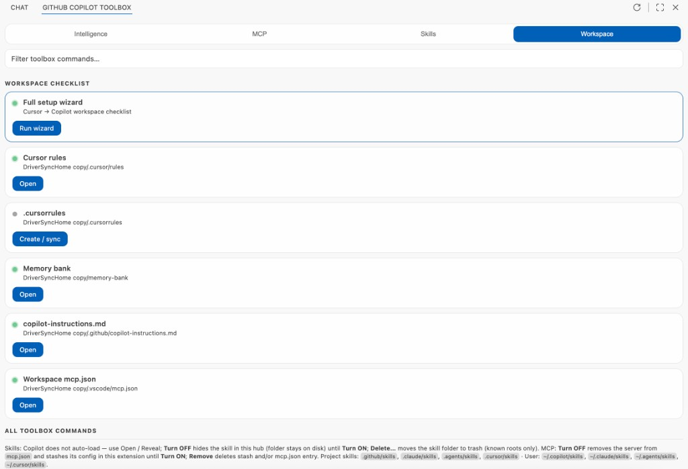
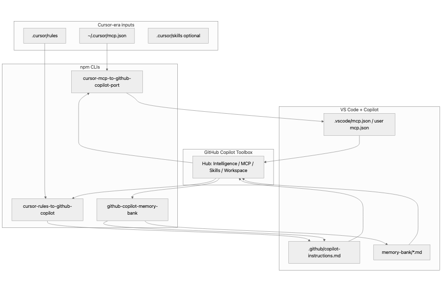

# GitHub Copilot Toolbox

**VS Code extension + monorepo:** [`Github-Copilot-ToolBox`](https://github.com/amitchorasiya/Github-Copilot-ToolBox) on GitHub · **License:** [MIT](LICENSE) · **Marketplace:** `amitchorasiya.github-copilot-toolbox`

## One place for Copilot-related setup

**In plain terms:** Copilot only works as well as the setup around it—but that setup is usually scattered across files, machines, and habits. **GitHub Copilot Toolbox** is **one dedicated Copilot Toolbox in VS Code**: you can **see** what’s configured, **standardize** how teams move to Copilot (including from Cursor), and **give Chat better context** while each developer still **chooses** what to share.

**For engineering teams, that means:**

- **Faster path from Cursor to Copilot** — guided actions to port connections (MCP), rules, and scaffold a memory bank.
- **Discover and add servers and skills from one hub** — browse catalogs, see what’s already installed, fewer raw config edits.
- **A single checklist view** — workspace vs personal setup, local skill folders, rules, instructions, and memory bank so the repo matches what you think you shipped.
- **Smarter context for Chat** — structured “context packs” and readiness flows, with **explicit** choices so teams stay aligned on what Copilot is allowed to see.

---

## Table of contents

- [One place for Copilot-related setup](#one-place-for-copilot-related-setup)
- [What’s in this repo](#whats-in-this-repo)
- [See the real UI (screenshots)](#see-the-real-ui-screenshots)
- [MCP & skills hub: every tab, toggle, and button](#mcp--skills-hub-every-tab-toggle-and-button)
- [Why it exists](#why-it-exists)
- [Quick start (extension)](#quick-start-extension)
- [Install the extension](#install-the-extension)
- [Companion tools (npm + GitHub)](#companion-tools-npm--github)
- [Repository layout](#repository-layout)
- [Development](#development)
- [CI](#ci)
- [Publishing (VSIX / Marketplace)](#publishing-vsix--marketplace)
- [Configuration & commands](#configuration--commands)
- [Security & privacy](#security--privacy)
- [Contributing](#contributing)
- [Disclaimer](#disclaimer)

---

## What’s in this repo

| Deliverable | Purpose |
|-------------|---------|
| **[GitHub Copilot Toolbox](packages/github-copilot-toolbox/)** | VS Code extension: **MCP & skills** hub, **workspace kit**, **Guide & tools**, **Intelligence** (context packs, readiness, MCP/Skills awareness report, auto-scan on folder open, `.cursor`→`.agents` skill migration), Cursor→Copilot `npx` bridges from the UI |
| **[memory-bank/](memory-bank/)** | Optional project memory files for you and Copilot (not required to build the extension) |
| **[packages/cursor-mcp-to-github-copilot-port/](packages/cursor-mcp-to-github-copilot-port/)** | Placeholder README for the MCP port CLI layout; the CLI is published separately on npm |

The extension does **not** replace GitHub Copilot or Cursor; it helps you **align configs** and **see** what’s configured (MCP servers, local `SKILL.md` trees, instructions files). Deeper settings, keybindings, and troubleshooting: **[packages/github-copilot-toolbox/README.md](packages/github-copilot-toolbox/README.md)**.

### See the real UI (screenshots)

These are **actual VS Code UI captures** from the extension—what users see on screen. Most hub shots are **high-resolution** (~2.5k width) so labels stay readable in README and on the [project site](https://copilottoolbox.layai.co).

#### After install: how do I open Copilot Toolbox?

**There is no separate application**—the extension lives **inside Visual Studio Code** only.

1. **Install** *GitHub Copilot Toolbox* from the Marketplace (or a `.vsix`). If VS Code prompts you, **reload the window** (**Developer: Reload Window**).
2. Find the **Activity Bar**: the **narrow column of icons on the far left** of the VS Code window (Explorer, Search, Source Control, …).
3. Click the **Copilot Toolbox** icon added by this extension. The **Side Bar** opens next to it.
4. In the Side Bar, click **MCP & skills**. That opens the **hub** (webview) with tabs **Intelligence**, **MCP**, **Skills**, and **Workspace**—that is the main surface for MCP, skills, and setup flows.

**Don’t see the icon?** Press **Ctrl+Shift+P** (Windows/Linux) or **⌘⇧P** (macOS), type **GitHub Copilot Toolbox**, run any listed command (that wakes the extension UI), or run **Developer: Reload Window**, then repeat steps 2–4.



**Intelligence** (hub): **Port Cursor → Copilot** (MCP, rules, memory bank), then broader bridges, context pack, readiness, MCP & Skills scan.






**MCP**: installed workspace/user servers and registry browse.





**Skills**: catalog (skills.sh) and local installed `SKILL.md` trees.





**Workspace** checklist and **Intelligence** hub (context hygiene).




**Reference diagram** (exported map of Cursor vs Copilot surfaces; not a live UI capture).



---

## MCP & skills hub: every tab, toggle, and button

Open the **MCP & skills** hub from the **Side Bar** after you click **Copilot Toolbox** in the **Activity Bar** (see [After install](#after-install-how-do-i-open-copilot-toolbox) above). The hub is organized into **tabs**, a **Browse / Installed** switch (where applicable), a **search** field, optional **MCP chips**, and a **footer** legend.

### Main tabs (top)

| Tab | Purpose |
|-----|---------|
| **Intelligence** | Bridges (Cursor → VS Code), **Context hygiene** tiles, **Context & readiness** actions, plus auto-scan controls. Default tab. |
| **MCP** | **Browse** official registry search or **Installed** workspace + user servers from `mcp.json`. |
| **Skills** | **Browse** [skills.sh](https://skills.sh) catalog or **Installed** local folders that contain `SKILL.md` under standard roots. |
| **Workspace** | **Workspace checklist** (wizard, rules, memory bank, instructions, `mcp.json`) and **All toolbox commands** (searchable tiles). |

### Browse vs Installed (MCP and Skills only)

| Sub-tab | Purpose |
|---------|---------|
| **Browse** | Search remote catalog (MCP registry or skills.sh). Extra **chip** row appears on **MCP → Browse**. |
| **Installed** | Filter and manage what is already on this machine / in this workspace (`mcp.json` servers or discovered skill folders). |

### Auto-scan row (Intelligence tab only)

| Control | What it does |
|---------|----------------|
| **Checkbox** (long label about workspace folder open) | Toggles **`GitHubCopilotToolBox.intelligence.autoScanMcpSkillsOnWorkspaceOpen`**. When on: after a workspace opens (debounced), opens the **MCP & Skills awareness** report, refreshes hub data, and merges a replaceable MCP/skills block into **`.github/copilot-instructions.md`**; the same merge runs when you use **Scan now** with this enabled. |
| **Scan now** | Runs the awareness flow and refreshes the hub immediately (and updates `copilot-instructions.md` when the checkbox above is on). |

### Search box

Hidden on **Intelligence**. On other tabs it filters: **registry / skills.sh results** (Browse), **installed MCP servers or skills** (Installed), or **toolbox command tiles** (Workspace).

### MCP chip row (MCP → Browse only)

| Chip | What it does |
|------|----------------|
| **Registry** | Opens VS Code’s native MCP registry UI (`workbench.mcp.browseServers`). |
| **Add server** | Opens VS Code’s flow to add MCP configuration (`workbench.mcp.addConfiguration`). |
| **List (native)** | Lists servers in the MCP UI (`workbench.mcp.listServer`). |
| **Port Cursor → VS Code** | Runs the **`cursor-mcp-to-github-copilot-port`** `npx` bridge to map Cursor config into VS Code `mcp.json`. |
| **@mcp registry** | Opens this extension’s registry browse command. |
| **Refresh** | Reloads hub data from disk and config. |

### Intelligence → Context hygiene

| Area | What it does |
|------|----------------|
| **Snapshot** (callout) | Read-only counts: active workspace MCP servers, active user MCP servers, and whether **`.github/copilot-instructions.md`** exists (with line count). Clarifies this is file-based, not live Agent runtime. |
| **Scan Copilot/MCP files** | Heuristic scan for secret-shaped patterns in `mcp.json` and instruction files; results go to **Output**. |
| **Notepad → memory-bank** | Append **session notepad** content into a **`memory-bank/**/*.md`** file (preview, then write). |
| **New SKILL.md stub** | Creates **`.github/skills/<name>/SKILL.md`** starter. |
| **Verification checklist** | Multi-pick acknowledgement checklist before you ship. |
| **Bundled MCP recipe** | Merges a **sample server** from bundled recipes into **`.vscode/mcp.json`**. |
| **Run first test task** | Runs a **`tasks.json`** task (prefers a test-like name, else the first task). |

### Intelligence → Cursor → VS Code & Copilot (hero cards)

| Card / button | What it does |
|---------------|----------------|
| **Run npx port** (Port Cursor MCP) | Runs **`GitHubCopilotToolBox.portCursorMcp`** → `npx` **cursor-mcp-to-github-copilot-port**. |
| **GitHub** (same card) | Opens the port CLI repo in the browser. |
| **Run npx init** (GitHub Copilot memory bank) | Runs **`initMemoryBank`** → `npx` **github-copilot-memory-bank** (scaffold `memory-bank/`, merge instructions). |
| **GitHub** | Memory bank repo. |
| **Run converter** (Cursor rules to Copilot) | Runs **`syncCursorRules`** → `npx` **cursor-rules-to-github-copilot**. |
| **GitHub** | Rules converter repo. |
| **Run migration** (Migrate skills to `.agents`) | Runs **`migrateSkillsCursorToAgents`** — copy/move **`.cursor/skills`** → **`.agents/skills`** (workspace and/or user). |

### Intelligence → Context & readiness (hero cards)

| Button | What it does |
|--------|----------------|
| **Run scan** | Opens the **MCP & Skills awareness** markdown report (configured servers + local `SKILL.md` paths + how Agent/MCP differs from on-disk skills). |
| **Build pack** | **Context pack** quick picks → markdown for Copilot Chat (files, optional git/diagnostics, etc.). |
| **Run readiness** | Markdown **readiness** summary (instructions, rules, MCP, suggested next steps). |
| **Open settings** | Filtered **Intelligence-related** settings (`GitHubCopilotToolBox.intelligence.*`). |

### MCP → Browse (registry results)

| Control | What it does |
|---------|----------------|
| **Install** (on a registry card) | Installs that server entry into your MCP config via the extension. |
| **Load more results** | Paginates registry search. |

### MCP → Installed (each server card)

| Button | What it does |
|--------|----------------|
| **Turn OFF** | Removes the server from **`mcp.json`** and **stashes** its JSON in extension storage until you **Turn ON**. |
| **Turn ON** | Restores stashed config into **`mcp.json`**. |
| **Remove** | Deletes stash and/or the **`mcp.json`** entry (after confirmation). |
| **Edit mcp.json** | Opens workspace or user **`mcp.json`** in the editor (native MCP commands). |

### Skills → Browse (skills.sh catalog)

| Button | What it does |
|--------|----------------|
| **Install (project)** | Runs **`npx skills add`** targeting **project** skill roots (per skills.sh flow). |
| **Install (global)** | Same for **user** skill roots. |

### Skills → Installed (each skill card)

| Button | What it does |
|--------|----------------|
| **Turn OFF** | Hides that skill in the hub only (extension state); **folder stays on disk**. |
| **Turn ON** | Shows it again in the hub. |
| **Delete…** | Moves the skill folder to **trash** if it lives under a **known** skill root (confirmation). |
| **Open SKILL.md** | Opens the skill’s **`SKILL.md`**. |
| **Reveal folder** | Reveals the skill folder in the OS file explorer / sidebar. |

### Workspace → Workspace checklist (each row)

| Button | What it does |
|--------|----------------|
| **Run wizard** | **`workspaceSetupWizard`** — guided Cursor → Copilot checklist. |
| **Open** | Opens the target file or folder when it already exists. |
| **Create / sync** | Runs the associated command to create or sync that artifact when missing. |

### Workspace → All toolbox commands (grouped tiles)

Use the **search** box to filter. Each **tile** runs one command (same as Command Palette). Groups and actions:

**Intelligence:** Build context pack · Readiness summary · Intelligence settings · MCP port repo (GitHub) · Memory bank repo (GitHub) · Rules converter repo (GitHub) · Migrate skills `.cursor` → `.agents` · Scan MCP & Skills awareness · Copilot/MCP config scan · Append notepad → memory-bank · Create SKILL.md stub · Verification checklist · Apply bundled MCP recipe · Run first test task.

**Chat & session:** Open Copilot Chat · Session notepad · Copy notepad · Composer tips hub · Inline chat (Cursor-style).

**Rules & instructions:** Cursor vs Copilot reference · Translate @-mentions · Append `.cursorrules` · Open instruction file… · Create `.cursorrules` template · Sync Cursor rules → Copilot.

**MCP & Cursor bridges:** Open workspace `mcp.json` · Open user `mcp.json` · Toggle MCP discovery · Add server (native).

**Workspace setup:** Workspace wizard · Init memory bank.

**Docs & environment:** Copilot billing / usage · Environment sync checklist.

### Footer (hub)

Summarizes **skill search roots**, **Turn OFF/ON/Delete** behavior for skills, and **Turn OFF/Remove** behavior for MCP—so expectations are explicit without opening docs.

### Sidebar: view title actions

The **MCP & skills** and **Workspace kit** views expose a **Refresh** action in the view title to reload lists and webview state.

---

## Why it exists

- **Different formats:** Cursor uses `~/.cursor/mcp.json` and `mcpServers`; VS Code + Copilot expect `mcp.json` with a `servers` object and `stdio` / `http` types.
- **Different “skills” story:** Local `SKILL.md` folders are useful for humans and for tools that read them; **Copilot does not automatically ingest** arbitrary skill folders—the extension lists them for **browse / open** and documents that in the UI.
- **One sidebar:** Open workspace and user MCP, run port/sync/memory-bank CLIs, and run Intelligence flows without hunting commands.

---

## Quick start (extension)

```bash
git clone https://github.com/amitchorasiya/Github-Copilot-ToolBox.git
cd Github-Copilot-ToolBox/packages/github-copilot-toolbox
npm install
npm run compile
```

From the **monorepo root** (after dependencies are installed under the package above):

```bash
npm run compile    # same as npm run compile --prefix packages/github-copilot-toolbox
npm test
```

**Run in VS Code:** open this repository → **Run and Debug** → **Run Extension: GitHub Copilot Toolbox** (see [`.vscode/launch.json`](.vscode/launch.json)).

---

## Install the extension

- **Marketplace:** search for **GitHub Copilot Toolbox** or install by id:  
  `code --install-extension amitchorasiya.github-copilot-toolbox`
- **From VSIX:** build with `npm run package` inside `packages/github-copilot-toolbox/`, then **Install from VSIX…** in VS Code.

**Requirements:** VS Code **1.99+**, **GitHub Copilot**, **Node.js 18+** for `npx` bridges. **Git** on `PATH` for optional Intelligence “include git” (Windows: [Git for Windows](https://git-scm.com/download/win)).

---

## Companion tools (npm + GitHub)

These work alongside the extension; the **Intelligence** hub links to their repos and can run several via `npx`.

| npm package | Role | GitHub |
|-------------|------|--------|
| `cursor-mcp-to-github-copilot-port` | Port Cursor `mcp.json` → VS Code `mcp.json` | [Github-Copilot-ToolBox](https://github.com/amitchorasiya/Github-Copilot-ToolBox) |
| `github-copilot-memory-bank` | Scaffold `memory-bank/` + merge Copilot instructions | [Github-Copilot-Memory-Bank](https://github.com/amitchorasiya/Github-Copilot-Memory-Bank) |
| `cursor-rules-to-github-copilot` | Generate Copilot instruction files from `.cursor/rules` | [Github-Copilot-Cursor-Rules-Converter](https://github.com/amitchorasiya/Github-Copilot-Cursor-Rules-Converter) |

---

## Repository layout

```
.
├── LICENSE                          # MIT (applies to repo contents; see package LICENSEs)
├── README.md                        # This file
├── package.json                     # Private monorepo helper scripts (compile / test / package:extension)
├── packages/
│   ├── github-copilot-toolbox/      # VS Code extension — publish VSIX / Marketplace from HERE
│   │   ├── LICENSE                  # MIT (bundled in .vsix)
│   │   ├── package.json
│   │   ├── src/
│   │   └── README.md
│   └── cursor-mcp-to-github-copilot-port/   # Placeholder for optional vendored CLI
├── memory-bank/                     # Project docs for agents / Copilot
├── docs/                            # Static sales site for GitHub Pages (`npm run serve:site`)
├── screenshots/                     # README and docs: UI captures (incl. 00 access walkthrough) + reference diagram
└── .github/workflows/               # extension-ci.yml → multi-OS build + tests
```

---

## Development

1. `cd packages/github-copilot-toolbox && npm install`
2. `npm run compile` — TypeScript → `out/`
3. `npm test` — Vitest (unit tests for Intelligence helpers, skills, etc.)
4. F5 — extension host

**Tech stack (extension):** TypeScript, VS Code API `^1.99`, Vitest. See [packages/github-copilot-toolbox/README.md](packages/github-copilot-toolbox/README.md) for settings, keybindings, and caveats (`#file:` vs Add context, etc.).

---

## CI

Workflow: [`.github/workflows/extension-ci.yml`](.github/workflows/extension-ci.yml)

- Triggers on changes under `packages/github-copilot-toolbox/**`, root `package.json`, or the workflow file.
- **Matrix:** Ubuntu, Windows, macOS — `npm install`, `npm run compile`, `npm test`, verifies `out/extension.js` exists.

---

## Publishing (VSIX / Marketplace)

Always use **`packages/github-copilot-toolbox/`** as the extension root (matches `repository.directory` in that `package.json`).

```bash
cd packages/github-copilot-toolbox
npm install
npm run compile
npm run package          # stages monorepo README (+ screenshot URLs) for Marketplace, then vsce package
# npx vsce publish       # when you are logged in to the publisher (from this directory)
```

The `.vsix` **README** is the **monorepo root** [`README.md`](README.md) (same content as on GitHub), with image paths rewritten to `raw.githubusercontent.com` so the Marketplace page shows screenshots. [`packages/github-copilot-toolbox/README.md`](packages/github-copilot-toolbox/README.md) is restored after each package run for repo browsing and holds packaging notes, troubleshooting, and migration details.

From monorepo root: `npm run package:extension` (after `npm install` in the package directory).

The **`LICENSE`** file in `packages/github-copilot-toolbox/` is included in the VSIX for Marketplace compliance.

---

## Configuration & commands

Extension settings and command IDs use the prefix **`GitHubCopilotToolBox.*`**.

Notable settings (see extension README for the full list):

- `GitHubCopilotToolBox.npxTag`, `useInsidersPaths`
- `GitHubCopilotToolBox.intelligence.*` (context pack defaults, **auto-scan MCP & Skills on workspace open**, etc.)
- `GitHubCopilotToolBox.translateWrapMultilineInFence`

Open filtered settings: Command Palette → **Intelligence: open related settings** (or search `GitHubCopilotToolBox` in Settings UI).

---

## Security & privacy

- **MCP configs** may contain paths, env vars, or secrets. Treat `mcp.json` as sensitive; do not commit secrets.
- The extension **starts terminals** for `npx` bridges and may **spawn `git`** for optional Intelligence sections—only run servers and commands you trust.
- **skills.sh** / registry features call **public HTTP APIs**; review network use in corporate environments.

---

## Contributing

Issues and PRs are welcome. Please:

- Run `npm run compile` and `npm test` under `packages/github-copilot-toolbox/` before submitting.
- Keep changes focused; match existing TypeScript and doc style.

---

## License

This repository is released under the **MIT License**. See [LICENSE](LICENSE). The VS Code extension package includes its own [packages/github-copilot-toolbox/LICENSE](packages/github-copilot-toolbox/LICENSE) for distribution in `.vsix`.

---

## Disclaimer

**Independence and trademarks.** This monorepo is **independent** community tooling. It is **not** affiliated with, endorsed by, sponsored by, or maintained by Microsoft, GitHub, Cursor, OpenAI, Anthropic, or other vendors of products named in this documentation. **Visual Studio**, **Visual Studio Code**, **GitHub**, **GitHub Copilot**, **Cursor**, and other product names may be **trademarks** of their respective owners. For Microsoft’s naming and branding expectations around VS Code, see the official [Visual Studio Code brand guidelines](https://code.visualstudio.com/brand).

**Software warranty.** Code is released under the [MIT License](LICENSE). The license applies **“AS IS”**, without warranties of any kind, and limits liability—read the full license text shipped with the software.

**No professional services.** Documentation and the extension are **not** security audits, legal review, or architecture sign-off. Your team remains responsible for MCP servers, skills, credentials, `npx` packages, and what you send to AI features.

**Third parties.** The extension can run **`npx`** bridges, open registry or catalog UIs, and edit local config files. **npm packages**, **MCP servers**, **catalogs**, and **editor or Copilot features** are third-party; this project does **not** control their behavior, availability, or terms. Evaluate them before you install, connect, or execute them.

**Your data and configs.** You are responsible for backups, secrets hygiene, and compliance with your employer’s and vendors’ policies when using AI tooling and automation.
